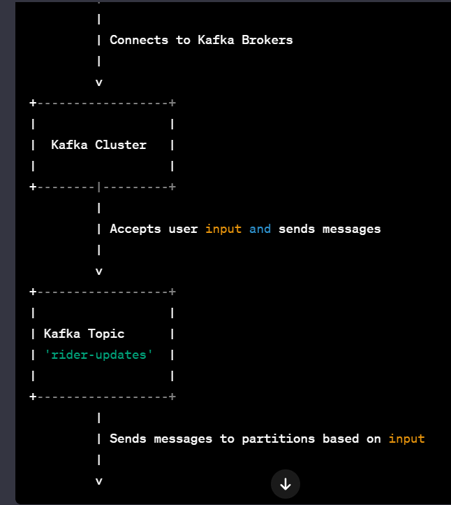

<h1>Kafka Application Overview</h1>
High-Level Overview
This document provides a high-level overview of a Kafka application that includes producers, consumers, and administrative functionalities.

1. Admin Initialization (admin.js):
The admin.js script initializes the Kafka admin client, responsible for managing topics and interacting with the Kafka cluster.

Workflow:
The admin client connects to the Kafka brokers.
A Kafka topic named 'rider-updates' is created with 2 partitions.
The admin client disconnects.
2. Kafka Client Initialization (client.js):
The client.js script initializes the Kafka client used by both producers and consumers.

Workflow:
The Kafka client connects to the Kafka brokers.
3. Consumer Initialization (consumer.js):
The consumer.js script initializes a Kafka consumer that subscribes to the 'rider-updates' topic.

Workflow:
The consumer connects to the Kafka brokers.
It subscribes to the 'rider-updates' topic from the beginning.
The consumer processes incoming messages, logging details.
4. Producer Initialization (producer.js):
The producer.js script initializes a Kafka producer that accepts user input and sends messages to the 'rider-updates' topic.

Workflow:
The producer connects to the Kafka brokers.
It accepts user input, sending messages to partitions based on input.
Images:

